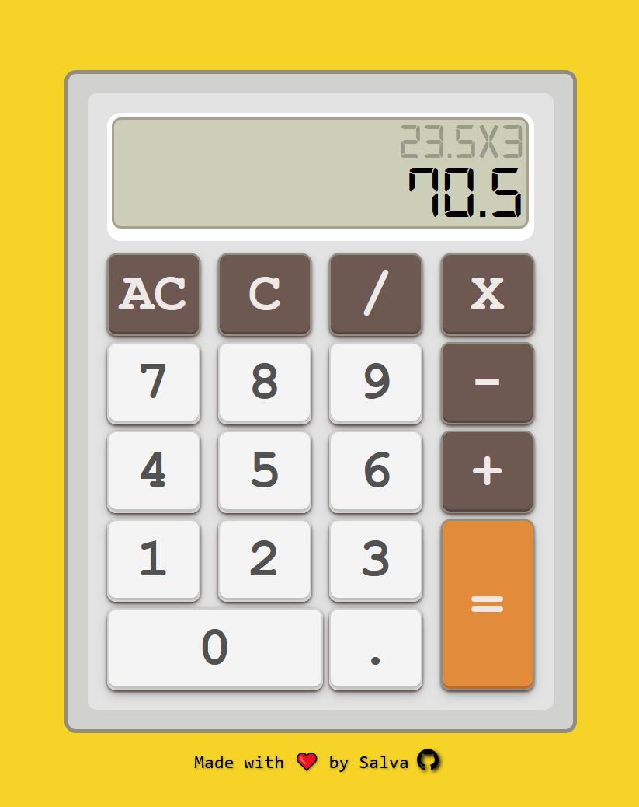

# 🧮 Calculator App

A modern and responsive calculator built with vanilla JavaScript, HTML, and CSS. Designed with a retro aesthetic inspired by classic calculators but with all modern functionalities.
[Check It Out!](https://smad2.github.io/calculator/)

   

<div align="center">




</div>

### 🎯 Core Functionality
- **Basic operations**: Addition, subtraction, multiplication, and division
- **Dual display**: Main display and secondary screen showing operations
- **Decimal support**: Full decimal number support
- **Error handling**: Division by zero and invalid operation management
- **Responsive design**: Adapts to mobile devices and tablets

### ⌨️ Multiple Interaction Methods
- **Button clicks**: Intuitive visual interface
- **Full keyboard support**: Numeric keypad and standard keyboard
- **Quick shortcuts**:
  - `Enter` or `=` to calculate
  - `Escape` to clear all (AC)
  - `Backspace` to delete last digit (C)
  - Number keys and operators

### 🎨 Design & UX
- **Digital-7 font**: Authentic LCD display style
- **Customizable theme**: CSS variables for easy customization
- **Visual effects**: Buttons with tactile feedback
- **Auto-adjustment**: Numbers automatically scale to prevent overflow
- **Smooth transitions**: Animations on interactions

## 🏗️ Technical Architecture

### File Structure
```
calculator/
├── index.html          # Main structure
├── css/
│   └── style.css       # Styles and CSS variables
├── js/
│   ├── main.js         # Entry point and UI configuration
│   ├── controller.js   # Control logic and state management
│   └── calculator.js   # Pure mathematical functions
└── fonts/
    └── digital-7.ttf   # Display font
```

### Implemented Patterns
- **Separation of concerns**: Logic, UI, and styles separated
- **Factory pattern**: Modular controllers
- **Event delegation**: Efficient event management
- **Composition over inheritance**: Flexible architecture

## 🚀 How to Use

### Installation
```bash
# Clone the repository
git clone https://github.com/smad2/calculator.git

# Navigate to project
cd calculator

# Open index.html in your browser
```

### Basic Operations
1. **Enter numbers**: Click number buttons or use keyboard
2. **Select operation**: +, -, ×, ÷
3. **Calculate**: `=` button or `Enter` key
4. **Clear**:
   - `C` (Delete) - Delete last digit
   - `AC` (All Clear) - Reset calculator

### Advanced Features
- **Operator switching**: Click new operator before entering second number
- **Consecutive operations**: Press `=` multiple times to repeat last operation
- **Decimal management**: Decimal point with anti-multiple point validation


## 📱 Compatibility

- ✅ Chrome, Firefox, Safari, Edge
- ✅ Mobile devices (responsive)
- ✅ Physical keyboard support
- ✅ Touch devices

## 🤝 Contributing

Found a bug or have an idea for improvement?
1. Fork the project
2. Create a feature branch (`git checkout -b feature/AmazingFeature`)
3. Commit your changes (`git commit -m 'Add some AmazingFeature'`)
4. Push to the branch (`git push origin feature/AmazingFeature`)
5. Open a Pull Request

## 📄 License

Distributed under the MIT License. See `LICENSE` for more information.

## 👨‍💻 Author

**Salva** - [GitHub](https://github.com/smad2)
